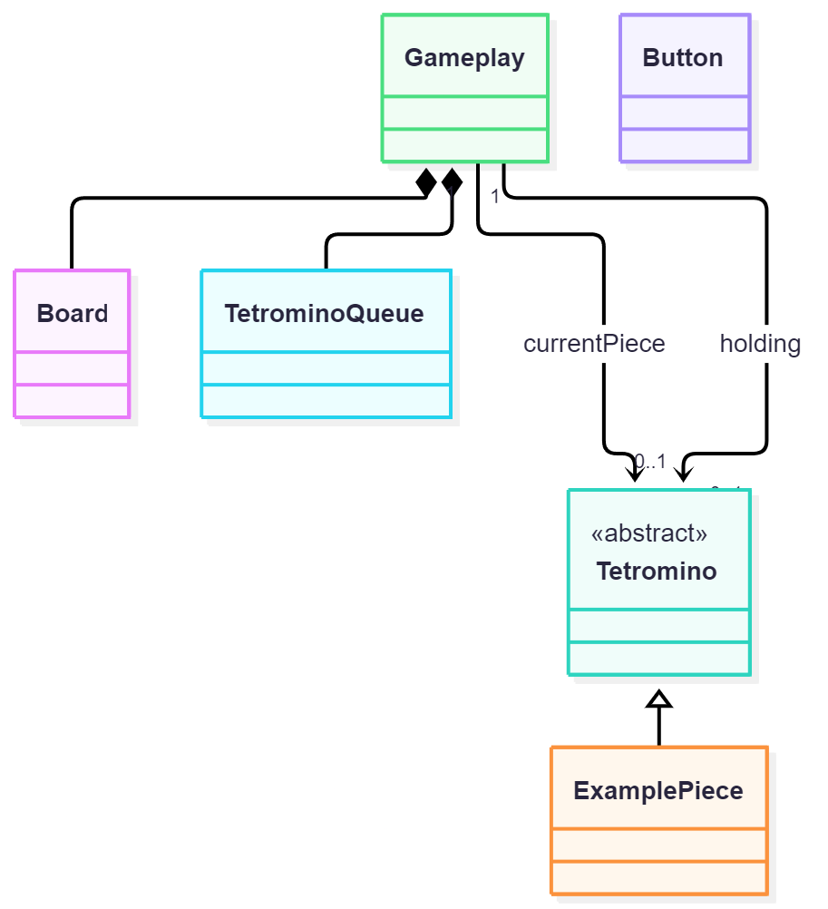

# Tetorisu Practice Tool (infdev version)

## This project is an assignment submission for an Object-Oriented Programming course

A Modern Mechanical Tetris game based on the [Tetris Guideline Ruleset](https://tetris.wiki/Tetris_Guideline). 
The main gameplay premise involves stacking a set of 7 different shaped blocks (tetrominos) on a 20x10 grid board to gain as much points as possible over an unlimited period of time. 

Clear lines and gain additional points by completely filling any rows on the grid. The more lines you clear at the same time the higher the points multiplier you will get. 

## Gameplay controls
|Keybinds|Function|
|---|---|
|**Right arrow**| Move piece right |
|**Left arrow**| Move piece left |
|**Down arrow**| Soft-drop piece |
|**Space**| Hard-drop piece |
|**Up arrow** or **X**| Rotate piece Clockwise |
|**Z**| Rotate piece Counter-clockwise|
|**A**| Rotate piece 180-degrees|
|**C**| Swap piece into Hold|

## This code is object-oriented based and designed after an UML standard, making it simple to read.

  

## Detailed Featureset

| Topic | Details |
|---|---|
| **Game loop & Window setup** | Create the game window, configure the frame rate, and structure the update/draw loop |
| **Board class** | Represent the (4 + 20)×10 board as a 2D array and 4 hidden rows, draw cells with colour-coded values |
| **Inheritance & Polymorphism** | Model all 7 tetrominoes using a bounding-grid approach across 4 rotation states. Use a Virtual-Based `Tetromino` class with 7 Derived classes (`OPiece`, `IPiece`, `TPiece`, etc.) |
| **Movement** | Move pieces left, right, down, and hard drop |
| **Rotation** | Rotate clockwise, counter clockwise, 180-degrees with state cycling and undo on invalid moves |
| **Collision detection** | Boundary checking and cell-occupancy checks to prevent overlapping or out-of-bounds moves |
| **Block locking** | Lock a piece into the grid when it can no longer move down and spawn the next piece |
| **Row clearing** | Detect full rows, clear them, and shift all rows above downward |
| **Scoring** | Award 100 / 300 / 500 / 800 points for 1 / 2 / 3 / 4 line clears, plus 1 point per manual soft drop and 2 * 'Valid Empty Row' points per hard drop |
| **UI** | Score display, next pieces and hold piece preview panels, Pause Button and a Game Over, Paused message |
| **Game reset** | Restart the game by pressing 'R' after Game Over |

---
# Miscellaneous 

## History

**22-30/9/2026**: Started UML Building

**31/9-8/10/2026**: Implementation

**9/10/2026**: First commit on GitHub!!!

## Contributor members (temporary)

| Name | Role |
|---|---|
| **Lê Văn Minh** | **Leader**, UML Constructor, Complete Coding-Logic |
| **Trần Hoàng Đức** | Board/Grid class Implementation, Documentation |
| **Nguyễn Anh Phú** | Tetrominoes classes Implementation |
| **Vương Nguyễn Minh Nhật** | Gameplay class Implementation |
| **Đặng Quốc Duy** | TetrominoQueue class Implementation |

## In the Future

- Introducing additional gamemodes:
Sprint (Timed 40 line clear), Ultra (Timed best score) and Grandmaster.

- Implementing a PvE mode where players can compete against a bot. 

